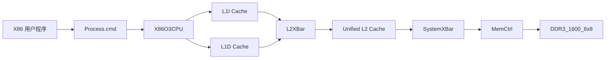
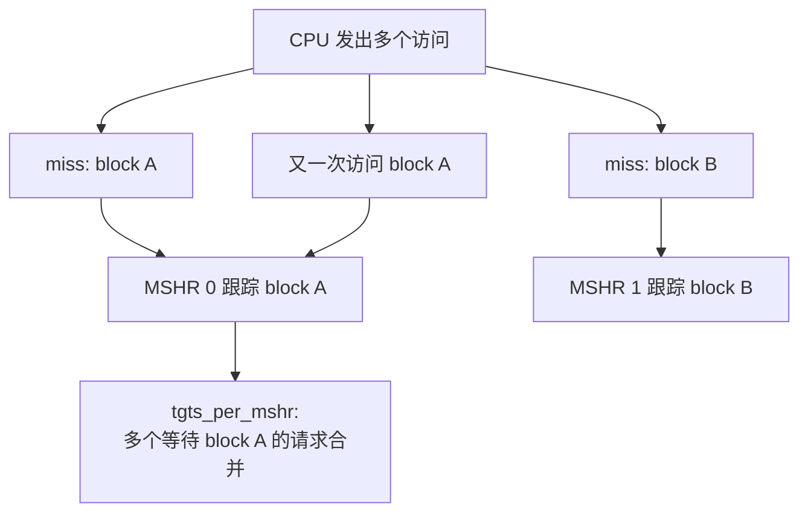
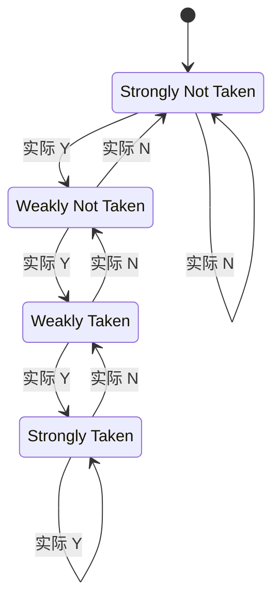
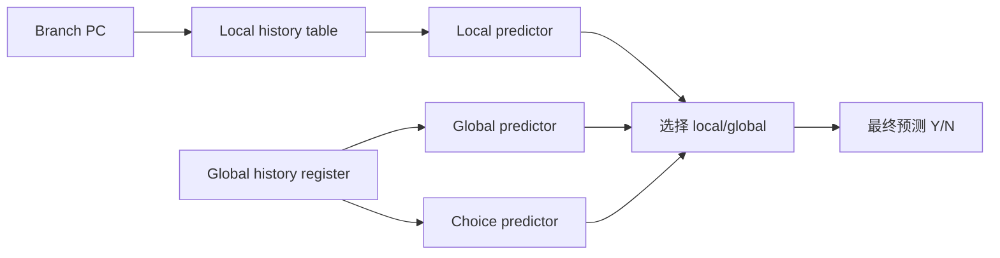
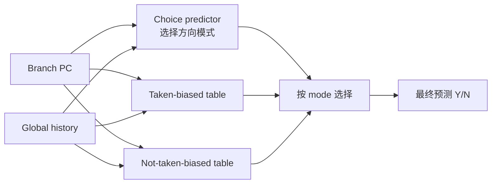
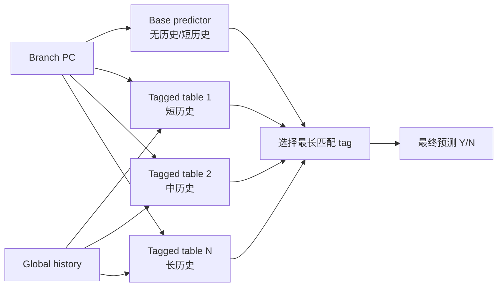

# 第二次实验：gem5 CPU 搭建与分支预测器探索教学材料

本材料按课堂讲解顺序组织为四大节：实验前提、初步搭建 CPU、探索 Local 分支预测器、探索高级分支预测器。课程目标不是让大家记住某个配置脚本，而是能从零搭建一个可运行自定义 X86 程序的 gem5 CPU 系统，并用实验数据解释不同分支模式为什么适合不同分支预测器。

## 1. 实验前提

### 1.1 本实验要完成什么

本课程重点讲授两件事：

1. 如何在 gem5 中搭建一个 CPU 仿真器，并运行自己编译的 C++ 程序。
2. 如何构造不同分支模式，观察这些模式分别适合哪一种分支预测器。

本实验固定处理器主体、Cache、内存和预测器内部参数，只改变两类变量：

- 分支程序本身的行为，例如稳定偏置、短历史相关、全局 mode 相关、长历史相关。
- CPU 使用的分支预测器类型，例如 `local`、`tournament`、`bimode`、`tage`。

本实验不是 Cache 调参实验，也不是乱序处理器性能调优实验。Cache 是搭建 CPU 系统时不可绕开的环节；本节课真正关注的是：程序分支模式、分支预测正确率、IPC 三者之间的关系。

### 1.2 获取实验代码

本实验代码位于 GitHub 仓库：

```text
https://github.com/K1ssMe520/thu_gem5_experimental_2026
```

本次课使用仓库中的第二次实验目录：

```text
第二次实验_CPU搭建与分支预测
```

假设你的 gem5 已经下载并编译完成，且 X86 版本模拟器位于：

```text
<gem5根目录>/build/X86/gem5.opt
```

请在 `<gem5根目录>/configs` 目录下下载课程代码，并把第二次实验文件夹复制为 `branch_pred_lab`，使最终目录形如：

```text
<gem5根目录>/configs/branch_pred_lab/
```

```bash
cd <gem5根目录>/configs
git clone https://github.com/K1ssMe520/thu_gem5_experimental_2026.git
cp -r thu_gem5_experimental_2026/第二次实验_CPU搭建与分支预测 ./branch_pred_lab
cd <gem5根目录>
```

本实验假设已经满足：

- 已经下载 gem5。
- 已经编译出 `build/X86/gem5.opt`。
- 系统中有 `/usr/bin/g++` 或可用的 `g++`。
- 当前终端工作目录是 `<gem5根目录>`。

### 1.3 实验文件分别做什么

`branch_pred_lab/` 中的文件作用如下。注意：`o3_bp_config.py` 不在初始代码中提供，需要在课堂上根据本文档创建。

| 文件 | 用途 | 是否需要填写或修改 |
|---|---|---|
| `branchy_benchmark.cpp` | 多分支 C++ benchmark，可通过参数生成不同分支模式 | 通常不需要 |
| `extract_stats.py` | 从 gem5 的 `stats.txt` 中提取 IPC、分支预测数、错误数、正确率 | 不需要 |
| `README.md` | 实验文件和快速命令说明 | 不需要 |
| `TEACHING.md` | 本课堂讲解材料 | 不需要 |
| `LAB_INSTRUCTIONS.md` | 面向快速完成实验的步骤说明 | 不需要 |
| `第二次实验报告模板.docx` | 实验报告模板，包含截图和解释占位 | 需要填写 |
| `第二次实验结果空表.csv` | 空 CSV 表头模板 | 需要填入实验结果 |

仓库中还包含第三次实验预留目录。本次课只使用第二次实验目录中的文件。

### 1.4 本课程完整剧情

| 阶段 | 做什么 | 想证明什么 |
|---|---|---|
| 1 | 搭建两级 Cache CPU，运行 hello | gem5 能运行自己编译的 X86 程序 |
| 2 | 无有效预测器跑 `predictable` | 没有有效分支预测时，稳定分支也会造成明显性能损失 |
| 3 | LocalBP 跑 `predictable` | LocalBP 能学习稳定偏置分支 |
| 4 | LocalBP 跑 `tournament` | LocalBP 不擅长短历史模式 |
| 5 | TournamentBP 跑 `tournament` | TournamentBP 可以利用 local/global history 提升 |
| 6 | LocalBP 跑 `bimode` | LocalBP 不擅长全局 mode 控制的相反偏置 |
| 7 | BiModeBP 跑 `bimode` | BiModeBP 可以把 taken/not-taken 倾向分开，减少干扰 |
| 8 | LocalBP 跑 `tage` | LocalBP 不擅长长历史相关 |
| 9 | TAGE 跑 `tage` | TAGE 可以用多长度历史捕捉长距离相关性 |

### 1.5 什么是 SE mode

gem5 常见有两类模式：

| 模式 | 全称 | 含义 | 本实验是否使用 |
|---|---|---|---|
| SE mode | Syscall Emulation | 只运行用户态程序，系统调用由 gem5 模拟 | 使用 |
| FS mode | Full System | 启动完整操作系统镜像 | 不使用 |

本实验使用 SE mode。我们不会启动 Linux 内核，也不会准备磁盘镜像；我们只把一个由 `g++` 编译出的 X86 用户程序交给 gem5 的 CPU 模型运行。

### 1.6 命令行参数要分清两层

初学者最容易混淆的是 gem5 参数、配置脚本参数、被测程序参数。看下面这条命令：

```bash
./build/X86/gem5.opt \
  -d configs/branch_pred_lab/results/local_tournament \
  configs/branch_pred_lab/o3_bp_config.py \
  --binary configs/branch_pred_lab/branchy_benchmark \
  --bp-type local \
  --program-args "--iterations 50000 --scenario tournament --period 8 --history-len 96 --working-set 4096 --seed 1"
```

分层理解：

| 部分 | 解释 |
|---|---|
| `./build/X86/gem5.opt` | 启动 gem5 模拟器 |
| `-d .../results/local_tournament` | 指定 gem5 输出目录 |
| `configs/branch_pred_lab/o3_bp_config.py` | 指定 Python 配置脚本，用来搭建 CPU 系统 |
| `--binary .../branchy_benchmark` | 传给配置脚本，指定被模拟程序 |
| `--bp-type local` | 传给配置脚本，指定 CPU 使用哪种分支预测器 |
| `--program-args "..."` | 传给配置脚本，再由配置脚本转交给 benchmark 程序 |
| `--scenario tournament` | benchmark 自己的参数，控制分支模式 |

> Coding Time 提醒：从第一次运行开始就保留截图。需要截图的内容包括命令行、程序输出、`stats.txt` 提取结果和自己填写的 CSV/报告。

## 2. 初步搭建 CPU

### 2.1 从一个 hello 程序开始

先创建一个最简单的 C++ 程序，确认自己能编译 X86 可执行文件，并让 gem5 运行它。创建文件：

```text
configs/branch_pred_lab/hello_student.cpp
```

内容如下：

```cpp
#include <iostream>
#include <string>

int main(int argc, char **argv) {
    std::string student_id = argc > 1 ? argv[1] : "unknown_id";
    std::string name = argc > 2 ? argv[2] : "unknown_name";
    std::cout << "Hello gem5\n";
    std::cout << "student_id=" << student_id << "\n";
    std::cout << "name=" << name << "\n";
    return 0;
}
```

编译：

```bash
/usr/bin/g++ -O2 -std=c++17 -march=x86-64 -mtune=generic \
  configs/branch_pred_lab/hello_student.cpp \
  -o configs/branch_pred_lab/hello_student
```

本机先运行一次：

```bash
configs/branch_pred_lab/hello_student 20240001 ZhangSan
```

如果本机都不能运行，不要进入 gem5。

### 2.2 gem5 CPU 系统由哪些组件组成

一个最小的 SE-mode CPU 系统通常包含：

| 组件 | gem5 对象 | 作用 |
|---|---|---|
| 整台机器 | `System` | 所有 SimObject 的根 |
| 时钟/电压 | `SrcClockDomain`、`VoltageDomain` | 指定模拟系统时钟 |
| CPU | `X86O3CPU` | 执行 X86 指令 |
| L1 指令 Cache | `L1ICache` | 服务取指令 |
| L1 数据 Cache | `L1DCache` | 服务 load/store |
| L2 Cache | `L2Cache` | 统一二级 Cache |
| L1 到 L2 总线 | `L2XBar` | 连接两个 L1 和 L2 |
| 内存总线 | `SystemXBar` | 连接 L2、系统端口、内存控制器 |
| 内存控制器 | `MemCtrl` | 管理 DRAM 访问 |
| DRAM | `DDR3_1600_8x8` | 模拟主存 |
| 进程 | `Process` | 指定要运行的用户程序 |

结构图如下：



gem5 官方简单配置教程可作为参考：

- [Creating a simple configuration script](https://www.gem5.org/documentation/learning_gem5/part1/simple_config/)

课堂代码与官方教程的核心思想一致：创建 SimObject，连接端口，设置 workload，调用 `m5.simulate()`。

### 2.3 Cache 不是重点，但必须搭

Cache 不是本节课的研究变量，但 CPU 不能凭空执行程序。取指令需要 L1I，load/store 需要 L1D，L1 miss 后需要 L2 和内存。因此我们要搭一个合理的两级 Cache 系统。

L1 分成 I/D 的原因：

- 取指令和读写数据可以并行。
- 指令流和数据流访问模式不同，分开后互相干扰少。
- L1I 主要读指令，L1D 需要处理读写数据。

Cache 参数含义：

| 参数 | 含义 |
|---|---|
| `size` | Cache 容量，例如 `32KiB`、`512KiB` |
| `assoc` | 组相联度，例如 2-way、8-way。相联度越高，同一个 set 中可选择的位置越多，冲突 miss 通常更少，但硬件查询更复杂 |
| `tag_latency` | 查 tag 的延迟。Cache 先用 tag 判断“这个地址的数据是否在 Cache 中” |
| `data_latency` | 读写 data array 的延迟。tag 命中后，真正读出或写入 cache line 的数据 |
| `response_latency` | 返回响应的延迟。Cache 把命中结果或 miss 返回数据交给上一级需要的额外时间 |
| `mshrs` | Miss Status Holding Registers 数量，表示能同时跟踪多少个未完成 miss |
| `tgts_per_mshr` | 同一个 miss block 下能合并多少个请求 |
| `cpu_side` | 朝向 CPU 或上一级 Cache 的端口。L1 的 `cpu_side` 连接 CPU，L2 的 `cpu_side` 连接 L2XBar |
| `mem_side` | 朝向下一级存储层的端口。L1 的 `mem_side` 连接 L2XBar，L2 的 `mem_side` 连接 SystemXBar |

`mshrs` 和 `tgts_per_mshr` 可以这样理解：



- `mshrs=8` 表示最多可以同时跟踪 8 个不同 cache block 的 miss。
- `tgts_per_mshr=20` 表示如果很多请求都在等同一个 block，最多可以合并 20 个目标。

### 2.4 创建初版 `o3_bp_config.py`

初始代码中不包含 `o3_bp_config.py`。请在课堂上自己创建：

```text
configs/branch_pred_lab/o3_bp_config.py
```

先创建不带可配置分支预测器的版本，用来运行 hello。下面按“给一段代码、解释一段”的方式写。同学们可以把这些代码按顺序拼接成一个完整的 `o3_bp_config.py`，也可以对照 gem5 官方 simple config 教程理解每一步。

第一段：导入 gem5 模块和 Python 标准库。

```python
import argparse
import os
import sys

import m5
from m5.objects import *
```

`argparse` 用来解析命令行参数，`m5` 和 `m5.objects` 提供 gem5 的 SimObject，例如 `System`、`X86O3CPU`、`Cache`、`MemCtrl`。

第二段：把 gem5 根目录加入 Python 路径。

```python
def add_common_path():
    this_dir = os.path.dirname(os.path.realpath(__file__))
    gem5_root = os.path.abspath(os.path.join(this_dir, "../.."))
    sys.path.append(gem5_root)


add_common_path()
```

这段的作用是让配置脚本无论从哪里启动，都能找到 gem5 根目录相关模块。这里的 `../..` 是因为文件位于 `configs/branch_pred_lab/`，向上两级就是 gem5 根目录。

第三段：定义 L1 Cache 基类。

```python
class L1Cache(Cache):
    assoc = 2
    tag_latency = 2
    data_latency = 2
    response_latency = 2
    mshrs = 8
    tgts_per_mshr = 20

    def connect_bus(self, bus):
        self.mem_side = bus.cpu_side_ports
```

这个类写的是 L1I 和 L1D 共有的参数。`connect_bus()` 表示 L1 Cache 的下一级连接到总线的 CPU 侧端口，因为从总线角度看，L1 是请求发起方。

第四段：定义 L1I 和 L1D。

```python
class L1ICache(L1Cache):
    def __init__(self, size):
        super().__init__()
        self.size = size

    def connect_cpu(self, cpu):
        self.cpu_side = cpu.icache_port


class L1DCache(L1Cache):
    def __init__(self, size):
        super().__init__()
        self.size = size

    def connect_cpu(self, cpu):
        self.cpu_side = cpu.dcache_port
```

L1I 连接 `cpu.icache_port`，只负责取指；L1D 连接 `cpu.dcache_port`，负责 load/store。两者参数相似，但连接到 CPU 的不同端口。

第五段：定义 L2 Cache。

```python
class L2Cache(Cache):
    assoc = 8
    tag_latency = 20
    data_latency = 20
    response_latency = 20
    mshrs = 20
    tgts_per_mshr = 12

    def __init__(self, size):
        super().__init__()
        self.size = size

    def connect_cpu_side_bus(self, bus):
        self.cpu_side = bus.mem_side_ports

    def connect_mem_side_bus(self, bus):
        self.mem_side = bus.cpu_side_ports
```

L2 在 L1 和内存之间。`connect_cpu_side_bus()` 连接来自 L1 的 L2XBar，`connect_mem_side_bus()` 连接通往内存控制器的 SystemXBar。

第六段：解析命令行参数。

```python
def parse_args():
    parser = argparse.ArgumentParser(description="Run an X86 binary on a two-level-cache CPU.")
    parser.add_argument("--binary", required=True, help="X86 binary to run")
    parser.add_argument("--program-args", default="", help="Arguments passed to the binary")
    parser.add_argument("--clock", default="2GHz")
    parser.add_argument("--mem-size", default="512MiB")
    parser.add_argument("--l1i-size", default="32KiB")
    parser.add_argument("--l1d-size", default="32KiB")
    parser.add_argument("--l2-size", default="512KiB")
    return parser.parse_args()
```

这里先不加入分支预测器参数，只支持运行一个程序并设置 CPU/Cache/内存大小。

第七段：创建 System、时钟、内存范围和 CPU。

```python
def main():
    args = parse_args()

    system = System()
    system.clk_domain = SrcClockDomain(clock=args.clock, voltage_domain=VoltageDomain())
    system.mem_mode = "timing"
    system.mem_ranges = [AddrRange(args.mem_size)]

    system.cpu = X86O3CPU()
```

`System()` 是整台模拟机器；`mem_mode="timing"` 表示内存访问需要经过 timing 模型；`X86O3CPU()` 是本实验使用的 CPU 模型。

第八段：创建并连接 L1、L2 和总线。

```python
    system.cpu.icache = L1ICache(args.l1i_size)
    system.cpu.dcache = L1DCache(args.l1d_size)
    system.cpu.icache.connect_cpu(system.cpu)
    system.cpu.dcache.connect_cpu(system.cpu)

    system.l2bus = L2XBar()
    system.cpu.icache.connect_bus(system.l2bus)
    system.cpu.dcache.connect_bus(system.l2bus)

    system.l2cache = L2Cache(args.l2_size)
    system.l2cache.connect_cpu_side_bus(system.l2bus)

    system.membus = SystemXBar()
    system.l2cache.connect_mem_side_bus(system.membus)
```

拼接后，访问路径是：CPU -> L1I/L1D -> L2XBar -> L2 -> SystemXBar。

第九段：连接中断、系统端口和内存控制器。

```python
    system.cpu.createInterruptController()
    system.cpu.interrupts[0].pio = system.membus.mem_side_ports
    system.cpu.interrupts[0].int_requestor = system.membus.cpu_side_ports
    system.cpu.interrupts[0].int_responder = system.membus.mem_side_ports
    system.system_port = system.membus.cpu_side_ports

    system.mem_ctrl = MemCtrl()
    system.mem_ctrl.dram = DDR3_1600_8x8()
    system.mem_ctrl.dram.range = system.mem_ranges[0]
    system.mem_ctrl.port = system.membus.mem_side_ports
```

X86 SE 模式需要创建中断控制器。`system_port` 是 gem5 系统对象访问内存的通道。`MemCtrl` 和 `DDR3_1600_8x8` 组成主存模型。

第十段：设置被模拟程序。

```python
    process = Process()
    process.cmd = [args.binary] + args.program_args.split()
    system.workload = SEWorkload.init_compatible(args.binary)
    system.cpu.workload = process
    system.cpu.createThreads()
```

`process.cmd` 的第一项是可执行文件路径，后面是传给程序的参数。`createThreads()` 为 CPU 创建执行线程。

第十一段：启动仿真。

```python
    root = Root(full_system=False, system=system)
    m5.instantiate()

    print(f"Starting simulation: cmd={' '.join(process.cmd)}")
    exit_event = m5.simulate()
    print(f"Exiting @ tick {m5.curTick()} because {exit_event.getCause()}")


if __name__ == "__m5_main__":
    main()
```

`full_system=False` 表示 SE mode。`m5.instantiate()` 创建所有 SimObject 实例，`m5.simulate()` 开始模拟。把上面 11 段按顺序拼起来，就是初版 `o3_bp_config.py`。

运行 hello：

```bash
./build/X86/gem5.opt \
  -d configs/branch_pred_lab/results/hello \
  configs/branch_pred_lab/o3_bp_config.py \
  --binary configs/branch_pred_lab/hello_student \
  --program-args "20240001 ZhangSan"
```

需要保留截图：

- `hello_student.cpp` 代码截图。
- 编译 hello 的终端截图。
- gem5 运行 hello 的终端截图。
- `results/hello/simout` 中输出学号姓名的截图。

> Coding Time 1（建议 20 分钟）：完成 CPU 初步搭建和 hello 运行。
>
> 1. 创建 `hello_student.cpp`，把默认学号姓名改成自己的命令行输入。
> 2. 编译 hello，并在本机直接运行一次。
> 3. 按 2.4 节逐段创建 `o3_bp_config.py`，不要整段复制后不理解；每拼一段，确认它负责哪一类组件。
> 4. 用 `python3 -m py_compile configs/branch_pred_lab/o3_bp_config.py` 检查语法。
> 5. 用 gem5 运行 hello。
> 6. 保留截图：hello 源码、编译命令、本机运行输出、gem5 运行命令、`simout` 中的学号姓名输出。
> 7. 保存自己创建的 `o3_bp_config.py`，后面还要继续修改它。

## 3. 探索 Local 分支预测器

### 3.1 今天涉及的分支情况总览

在正式讲 LocalBP 之前，先把今天涉及的分支模式统一命名：

| 名字 | 典型序列 | 程序直觉 | LocalBP 预期表现 | 后续对应预测器 |
|---|---|---|---|---|
| 稳定偏置分支 | `YYYYYYYY...` 或 `NNNNNN...` | 循环大多数时候继续、条件大多数时候成立 | 好 | LocalBP 足够 |
| 短历史分支 | `YNYNYN...` 或短周期重复 | 当前方向由最近几次结果决定 | 差 | TournamentBP |
| 全局 mode 分支 | mode 不同，后续分支偏置相反 | 一个前置条件决定后面多条分支方向 | 差 | BiModeBP |
| 长历史分支 | `B(t)` 由很久以前的结果决定 | 当前方向依赖几十次之前的历史 | 差 | TAGE |

这里的 `B1`、`B2`、`B(t)` 都是抽象符号：

- `B1` 表示第 1 条静态分支，比如程序中的第一个 `if`。
- `B2` 表示第 2 条静态分支。
- `B(t)` 表示某条动态分支在第 `t` 次执行时的方向。
- `mode` 表示程序当前处于哪一种全局状态，例如“白天/夜晚模式”“读模式/写模式”“压缩/解压模式”。

### 3.2 LocalBP 和 2-bit 计数器

LocalBP 的核心思想是：每条静态分支按自己的 PC 去查一张表，表项里通常是 2-bit 饱和计数器。



LocalBP 适合稳定偏置分支。例如：

```cpp
for (int i = 0; i < 10000; ++i) {
    if (i < 9990) {     // 前 9990 次几乎都是 taken
        work_fast_path();
    } else {
        work_slow_path();
    }
}
```

这类分支执行足够多次后，2-bit 计数器会稳定在 taken 或 not-taken 一侧。冷启动最多错少数几次，长期正确率接近 100%。

LocalBP 不适合下面三类情况。

短历史分支例子：

```cpp
bool last = false;
for (int i = 0; i < n; ++i) {
    bool cond = !last;  // Y/N 交替
    if (cond) {
        path_a();
    } else {
        path_b();
    }
    last = cond;
}
```

LocalBP 只看到这条分支长期 50% taken、50% not-taken。它没有“上一次是 Y 所以下一次可能是 N”的历史判断能力。可能的解决办法是引入能使用历史信息的 TournamentBP。

全局 mode 分支例子：

```cpp
for (int i = 0; i < n; ++i) {
    bool mode = (i % 2 == 0);  // mode 分支或全局状态

    if (mode) {                // B0：告诉后续分支当前处于哪种状态
        enter_mode_a();
    } else {
        enter_mode_b();
    }

    if (mode) {                // B1：mode=A 时常 taken，mode=B 时常 not-taken
        path_for_a();
    } else {
        path_for_b();
    }
}
```

对 B1 自己看，长期可能是 50% Y、50% N。但如果知道前面 mode 是什么，B1 就很好预测。LocalBP 不看全局 mode，可能的解决办法是 BiModeBP。

长历史分支例子：

```cpp
bool history[128] = {};
for (int t = 128; t < n; ++t) {
    bool cond = history[t - 37] ^ history[t - 93];
    if (cond) {
        path_a();
    } else {
        path_b();
    }
    history[t % 128] = cond;
}
```

当前方向由很久以前的历史决定。LocalBP 只看当前分支自己的计数器，看不到 `t-37` 和 `t-93` 的信息。可能的解决办法是 TAGE。

### 3.3 编译并观察 Branch Benchmark

`branchy_benchmark.cpp` 是本实验提供的多分支程序。课堂中不要求逐行重写这个文件，但需要理解下面这些关键实现，否则后面很难解释分支预测结果。

- 程序里有 8 个静态分支点：`branch_site_0` 到 `branch_site_7`。
- `--scenario` 控制生成哪一种分支模式。
- `--trace` 固定输出前 100 个动态分支结果，并按 8 个分支点各占一行。
- 正式 gem5 性能测试时不要加 `--trace`，否则 I/O 会干扰性能。

第一段关键代码：用宏生成 8 个静态分支点。

```cpp
#define BRANCH_SITE(N)                                                        \
    NOINLINE void branch_site_##N(                                            \
        bool taken, std::vector<int> &data, std::size_t idx,                  \
        volatile std::uint64_t &sink)                                         \
    {                                                                         \
        if (taken) {                                                          \
            data[idx] = data[idx] * (3 + N) + (1 + N);                        \
            sink += static_cast<std::uint64_t>(data[idx] & (0xff + N));       \
        } else {                                                              \
            data[idx] = data[idx] / (3 + N) + (7 + N);                        \
            sink ^= static_cast<std::uint64_t>(data[idx] & (0xff + N))        \
                    << (N & 7);                                               \
        }                                                                     \
    }
```

这段代码的关键点不是算术本身，而是 `if (taken)`。它强制每个 `branch_site_N` 都产生一个真实条件分支。`NOINLINE` 避免编译器把函数内联掉，`no-if-conversion` 尽量避免编译器把分支改写成条件移动。

第二段关键代码：每一轮执行 8 个分支点。

```cpp
#define RUN_SITE(N, TAKEN_EXPR)                                               \
    do {                                                                      \
        const bool taken_##N = (TAKEN_EXPR);                                  \
        trace.add(N, taken_##N);                                              \
        branch_site_##N(                                                      \
            taken_##N, data, (base_idx + (N * 257U)) & index_mask, sink);     \
    } while (false)
```

`TAKEN_EXPR` 是每个分支点的方向公式。trace 会把前 100 个动态分支按 `branch0` 到 `branch7` 分行记录，方便观察同一静态分支随时间如何变化。

第三段关键公式：`predictable` 场景。

```cpp
const bool rare = phase == 0;
RUN_SITE(0, true);
RUN_SITE(1, false);
RUN_SITE(2, true);
RUN_SITE(3, false);
RUN_SITE(4, !rare);
RUN_SITE(5, rare);
RUN_SITE(6, true);
RUN_SITE(7, false);
```

这里大部分分支长期固定为 Y 或 N，`branch4` 大多数时候 Y，`branch5` 少数时候 Y。LocalBP 对这种稳定偏置非常有效。

第四段关键公式：`tournament` 场景。

```cpp
phase = (phase + 1) & 7U;
RUN_SITE(0, (phase & 1U) != 0);
RUN_SITE(1, (phase & 1U) == 0);
RUN_SITE(2, (phase & 2U) != 0);
RUN_SITE(3, (phase & 2U) == 0);
RUN_SITE(4, (phase & 3U) == 0);
RUN_SITE(5, (phase & 3U) == 1);
RUN_SITE(6, (phase & 4U) != 0);
RUN_SITE(7, (phase & 4U) == 0);
```

`phase` 在 0 到 7 之间循环，很多分支不是固定偏置，而是跟短周期历史有关。LocalBP 只能看单条分支自己的计数器，TournamentBP 可以利用历史上下文。

第五段关键公式：`bimode` 场景。

```cpp
++phase;
if (phase == opts.period) {
    phase = 0;
    mode = !mode;
}

RUN_SITE(0, mode);
RUN_SITE(1, mode ? !rare : rare);
RUN_SITE(2, mode ? !rare : rare);
RUN_SITE(3, mode ? rare : !rare);
RUN_SITE(4, mode ? rare : !rare);
RUN_SITE(5, mode ? !rare : rare);
RUN_SITE(6, mode ? rare : !rare);
RUN_SITE(7, !mode);
```

`mode` 是全局状态。`--period 1` 时，mode 每轮翻转。后续分支在不同 mode 下方向倾向相反，因此 BiModeBP 的方向表隔离能发挥作用。

第六段关键公式：`tage` 场景。

```cpp
const std::uint64_t patterns[4] = {
    0x9696969669696969ULL,
    0xe1e1e1e11e1e1e1eULL,
    0xf0f00f0f0f0ff0f0ULL,
    0xcc33cc3333cc33ccULL,
};

auto decide = [&](std::uint64_t salt) {
    const std::uint64_t pattern = patterns[salt & 3U];
    const std::uint64_t bit = (phase + salt * 9U) & 63U;
    return ((pattern >> bit) & 1U) != 0;
};
```

不同分支使用不同 `salt` 从多个长 bit pattern 中取位。这个场景制造出更长周期的可学习序列；单条分支的平均偏置不够稳定，但长历史上下文重复出现，TAGE 更容易匹配。

关键参数：

| 参数 | 含义 |
|---|---|
| `--iterations N` | benchmark 主循环次数 |
| `--scenario predictable` | 稳定偏置场景 |
| `--scenario tournament` | 短历史模式场景 |
| `--scenario bimode` | 全局 mode 场景 |
| `--scenario tage` | 长历史场景 |
| `--period N` | 控制周期或 mode 翻转速度 |
| `--history-len N` | 长历史场景中的历史长度提示参数 |
| `--working-set N` | 数据数组大小，要求 2 的幂 |
| `--seed N` | 初始化数据数组的种子 |

编译：

```bash
/usr/bin/g++ -O2 -std=c++17 -march=x86-64 -mtune=generic \
  configs/branch_pred_lab/branchy_benchmark.cpp \
  -o configs/branch_pred_lab/branchy_benchmark
```

观察四类场景：

```bash
configs/branch_pred_lab/branchy_benchmark --iterations 13 --scenario predictable --period 32 --trace
configs/branch_pred_lab/branchy_benchmark --iterations 13 --scenario tournament --period 8 --trace
configs/branch_pred_lab/branchy_benchmark --iterations 13 --scenario bimode --period 1 --trace
configs/branch_pred_lab/branchy_benchmark --iterations 13 --scenario tage --period 128 --history-len 96 --trace
```

需要保留截图：四个场景的 `--trace` 输出。

### 3.4 在 CPU 配置中加入 LocalBP

现在修改 `o3_bp_config.py`，加入 `--bp-type` 参数和 LocalBP。先在 `parse_args()` 中增加：

```python
parser.add_argument("--bp-type", choices=["none", "local"], default="local")
parser.add_argument("--local-size", type=int, default=2048)
parser.add_argument("--ctr-bits", type=int, default=2)
```

再加入函数：

```python
def build_branch_predictor(args):
    if args.bp_type == "none":
        return BranchPredictor(
            conditionalBranchPred=LocalBP(localPredictorSize=1, localCtrBits=1),
            btb=SimpleBTB(numEntries=1),
            ras=ReturnAddrStack(numEntries=1),
        )
    if args.bp_type == "local":
        return BranchPredictor(
            conditionalBranchPred=LocalBP(
                localPredictorSize=args.local_size,
                localCtrBits=args.ctr_bits,
            )
        )
    raise ValueError(f"unsupported bp type: {args.bp_type}")
```

最后在 `system.cpu = X86O3CPU()` 后面加入：

```python
system.cpu.branchPred = build_branch_predictor(args)
```

这里 `none` 不是完全没有预测器。`X86O3CPU` 需要一个 `BPredUnit` 对象，所以我们用 1 项 1-bit LocalBP 和 1 项 BTB 模拟“几乎没有有效预测能力”的基线。

### 3.5 `extract_stats.py` 怎么用

`extract_stats.py` 读取 gem5 输出目录里的 `stats.txt`，提取：

- `simTicks`
- `simInsts`
- `system.cpu.cpi`
- `system.cpu.ipc`
- `system.cpu.branchPred.condPredicted`
- `system.cpu.branchPred.condIncorrect`
- `condIncorrectRate`
- `condAccuracy`

运行方式：

```bash
python3 configs/branch_pred_lab/extract_stats.py \
  configs/branch_pred_lab/results/local_predictable/stats.txt
```

`condAccuracy` 是本实验最重要的预测器指标，`IPC` 是整体性能指标。

### 3.6 完整案例：LocalBP 运行 predictable 场景

下面每条命令都带注释，课堂上可以逐行解释。

```bash
# 使用系统 g++ 编译 benchmark，生成 X86-64 可执行文件
/usr/bin/g++ -O2 -std=c++17 -march=x86-64 -mtune=generic \
  configs/branch_pred_lab/branchy_benchmark.cpp \
  -o configs/branch_pred_lab/branchy_benchmark

# 用 gem5 运行 benchmark
# -d 指定输出目录
# o3_bp_config.py 搭建 CPU/Cache 系统
# --binary 指定被模拟的程序
# --bp-type local 指定使用 LocalBP
# --program-args 后面的字符串传给 benchmark
./build/X86/gem5.opt \
  -d configs/branch_pred_lab/results/local_predictable \
  configs/branch_pred_lab/o3_bp_config.py \
  --binary configs/branch_pred_lab/branchy_benchmark \
  --bp-type local \
  --program-args "--iterations 50000 --working-set 4096 --seed 1 --scenario predictable --period 32 --history-len 96"

# 从 gem5 输出的 stats.txt 中提取关键性能指标
python3 configs/branch_pred_lab/extract_stats.py \
  configs/branch_pred_lab/results/local_predictable/stats.txt
```

> Coding Time 2（建议 20 分钟）：对比无有效预测器与 LocalBP。
>
> 1. 编译 `branchy_benchmark.cpp`。
> 2. 运行 `predictable` 的 `--trace` 命令，观察稳定偏置分支的 Y/N 输出。
> 3. 对 `predictable` trace 输出截图，截图中要能看到 `branch0` 到 `branch7`。
> 4. 修改 `o3_bp_config.py`，加入 `--bp-type none/local` 和 `build_branch_predictor(args)`。
> 5. 运行 `predictable + none`、`predictable + local`，观察 LocalBP 对稳定偏置分支的提升。
> 6. 每次运行后执行 `extract_stats.py`，保留终端输出截图。
> 7. 把 `predictable + none` 和 `predictable + local` 两行的 `system.cpu.ipc`、`condIncorrectRate`、`condAccuracy` 填入 `第二次实验结果空表.csv`。
> 8. 在报告中写一句解释：为什么稳定偏置分支加入 LocalBP 后正确率和 IPC 会提升。

## 4. 探索高级分支预测器

### 4.1 先让 `o3_bp_config.py` 支持高级预测器

把 `parse_args()` 中 `--bp-type` 改成：

```python
parser.add_argument(
    "--bp-type",
    choices=["none", "local", "tournament", "bimode", "tage"],
    default="local",
)
parser.add_argument("--local-size", type=int, default=2048)
parser.add_argument("--local-hist-size", type=int, default=2048)
parser.add_argument("--global-size", type=int, default=8192)
parser.add_argument("--choice-size", type=int, default=8192)
parser.add_argument("--ctr-bits", type=int, default=2)
parser.add_argument("--tage-tables", type=int, default=7)
parser.add_argument("--tage-min-hist", type=int, default=5)
parser.add_argument("--tage-max-hist", type=int, default=130)
```

把 `build_branch_predictor(args)` 扩展成：

```python
def build_conditional_predictor(args):
    if args.bp_type == "none":
        return LocalBP(localPredictorSize=1, localCtrBits=1)
    if args.bp_type == "local":
        return LocalBP(localPredictorSize=args.local_size, localCtrBits=args.ctr_bits)
    if args.bp_type == "tournament":
        return TournamentBP(
            localPredictorSize=args.local_size,
            localHistoryTableSize=args.local_hist_size,
            globalPredictorSize=args.global_size,
            choicePredictorSize=args.choice_size,
            localCtrBits=args.ctr_bits,
            globalCtrBits=args.ctr_bits,
            choiceCtrBits=args.ctr_bits,
        )
    if args.bp_type == "bimode":
        return BiModeBP(
            globalPredictorSize=args.global_size,
            choicePredictorSize=args.choice_size,
            globalCtrBits=args.ctr_bits,
            choiceCtrBits=args.ctr_bits,
        )
    if args.bp_type == "tage":
        return TAGE(
            tage=TAGEBase(
                nHistoryTables=args.tage_tables,
                minHist=args.tage_min_hist,
                maxHist=args.tage_max_hist,
            )
        )
    raise ValueError(f"unsupported bp type: {args.bp_type}")


def build_branch_predictor(args):
    if args.bp_type == "none":
        return BranchPredictor(
            conditionalBranchPred=build_conditional_predictor(args),
            btb=SimpleBTB(numEntries=1),
            ras=ReturnAddrStack(numEntries=1),
        )
    return BranchPredictor(conditionalBranchPred=build_conditional_predictor(args))
```

### 4.2 TournamentBP：匹配短历史模式

先抛开程序看原理。TournamentBP 不是单一预测器，而是让 local predictor 和 global predictor 同时给出预测，再由 choice predictor 选择相信谁。



当一个分支主要由“自己过去的局部规律”决定时，choice 会逐渐偏向 local；当它主要由“最近所有分支形成的全局历史”决定时，choice 会逐渐偏向 global。

具体分支例子：

```cpp
bool last = false;
for (int i = 0; i < n; ++i) {
    bool cond = !last;
    if (cond) path_a(); else path_b();
    last = cond;
}
```

分支序列近似：

```text
Y N Y N Y N ...
```

LocalBP 的 2-bit counter 看到的是这条分支一半 Y、一半 N，因此会在中间来回摆动。

TournamentBP 多了三个关键模块：

| 模块 | 保存什么 | 在短历史场景中怎么变化 |
|---|---|---|
| local predictor | 单条分支的局部历史和计数器 | 对严格交替分支仍可能摇摆 |
| global predictor | 最近全局分支历史 GHR 对应的计数器 | 当 GHR=Y 时学到下次多为 N；GHR=N 时学到下次多为 Y |
| choice predictor | local/global 谁更可信 | 如果 global 连续正确、local 连续错误，choice 计数器向 global 方向移动 |

因此，当序列反复出现 `Y -> N`、`N -> Y` 时，global predictor 的表项会逐渐形成：

```text
history=...Y  => predict N
history=...N  => predict Y
```

choice predictor 观察到 global 更准后，会更多选择 global 结果。最终 TournamentBP 能匹配短历史模式。

实验命令：

```bash
./build/X86/gem5.opt -d configs/branch_pred_lab/results/local_tournament \
  configs/branch_pred_lab/o3_bp_config.py \
  --binary configs/branch_pred_lab/branchy_benchmark \
  --bp-type local \
  --program-args "--iterations 50000 --working-set 4096 --seed 1 --scenario tournament --period 8 --history-len 96"

./build/X86/gem5.opt -d configs/branch_pred_lab/results/tournament_tournament \
  configs/branch_pred_lab/o3_bp_config.py \
  --binary configs/branch_pred_lab/branchy_benchmark \
  --bp-type tournament \
  --program-args "--iterations 50000 --working-set 4096 --seed 1 --scenario tournament --period 8 --history-len 96"
```

### 4.3 BiModeBP：匹配全局 mode 控制的相反偏置

先抛开程序看原理。BiModeBP 关心的是“不同全局上下文下，同一条分支可能有相反偏置”。它把预测表分成 taken-biased 和 not-taken-biased 两类，再用 choice predictor 判断当前更应该进入哪一类。



如果当前上下文长期让某些分支偏向 taken，choice 会更多选择 taken-biased table；如果当前上下文长期让它们偏向 not-taken，choice 会更多选择 not-taken-biased table。

具体分支例子：

```cpp
for (int i = 0; i < n; ++i) {
    bool mode = (i % 2 == 0);
    if (mode) enter_a(); else enter_b();      // B0
    if (mode) path_a(); else path_b();        // B1
}
```

对 B1 来说，长期看是：

```text
Y N Y N Y N ...
```

LocalBP 只能看到 B1 自身 50/50，不知道 B1 的方向由前面的 mode 决定。

BiModeBP 的关键是把方向倾向分开：

| 模块 | 保存什么 | 在 mode 场景中怎么变化 |
|---|---|---|
| choice predictor | 当前全局历史更像 taken-mode 还是 not-taken-mode | mode=A 时逐渐选择 taken-biased table；mode=B 时逐渐选择 not-taken-biased table |
| taken-biased table | taken 倾向上下文中的计数器 | 在 mode=A 的上下文中计数器向 taken 饱和 |
| not-taken-biased table | not-taken 倾向上下文中的计数器 | 在 mode=B 的上下文中计数器向 not-taken 饱和 |

同一个 B1 在不同 mode 下进入不同方向表，避免同一个 2-bit counter 一会儿被推向 Y、一会儿被推向 N。最终 BiModeBP 能匹配“全局 mode 决定方向”的场景。

实验命令：

```bash
./build/X86/gem5.opt -d configs/branch_pred_lab/results/local_bimode \
  configs/branch_pred_lab/o3_bp_config.py \
  --binary configs/branch_pred_lab/branchy_benchmark \
  --bp-type local \
  --program-args "--iterations 50000 --working-set 4096 --seed 1 --scenario bimode --period 1 --history-len 96"

./build/X86/gem5.opt -d configs/branch_pred_lab/results/bimode_bimode \
  configs/branch_pred_lab/o3_bp_config.py \
  --binary configs/branch_pred_lab/branchy_benchmark \
  --bp-type bimode \
  --program-args "--iterations 50000 --working-set 4096 --seed 1 --scenario bimode --period 1 --history-len 96"
```

### 4.4 TAGE：匹配长历史相关

先抛开程序看原理。TAGE 使用多张 tagged table，每张表使用不同长度的历史。短历史表负责简单模式，长历史表负责远距离相关。预测时优先使用“tag 匹配且历史最长”的表项。



tag 的作用是确认“当前 PC + 当前历史”是否真的是以前见过的上下文；多历史长度的作用是避免只看短历史时漏掉远距离相关。

具体分支例子：

```cpp
bool history[128];
for (int t = 128; t < n; ++t) {
    bool cond = history[t - 37] ^ history[t - 93];
    if (cond) path_a(); else path_b();
    history[t % 128] = cond;
}
```

LocalBP 只知道当前分支 PC 的平均结果。如果 `cond` 长期接近 50/50，LocalBP 的 counter 没有稳定方向。

TAGE 的关键是多张不同历史长度的 tagged 表：

| 模块 | 保存什么 | 在长历史场景中怎么变化 |
|---|---|---|
| base predictor | 不使用或使用很短历史的基础预测 | 对 50/50 分支表现一般 |
| tagged table 短历史项 | PC + 短历史折叠索引 + tag | 能学简单短模式，但覆盖不了 `t-37`、`t-93` |
| tagged table 长历史项 | PC + 长历史折叠索引 + tag | 当长历史上下文重复出现时，tag 匹配，计数器向正确方向饱和 |
| provider 选择 | 选择最长匹配的表项 | 长历史表稳定后，优先使用长历史预测 |

当某个长历史上下文再次出现时，TAGE 的长历史 tagged entry 能识别“这不是普通 50/50 分支，而是一个见过的长历史模式”。因此它能匹配长历史相关。

实验命令：

```bash
./build/X86/gem5.opt -d configs/branch_pred_lab/results/local_tage \
  configs/branch_pred_lab/o3_bp_config.py \
  --binary configs/branch_pred_lab/branchy_benchmark \
  --bp-type local \
  --program-args "--iterations 50000 --working-set 4096 --seed 1 --scenario tage --period 128 --history-len 96"

./build/X86/gem5.opt -d configs/branch_pred_lab/results/tage_tage \
  configs/branch_pred_lab/o3_bp_config.py \
  --binary configs/branch_pred_lab/branchy_benchmark \
  --bp-type tage \
  --program-args "--iterations 50000 --working-set 4096 --seed 1 --scenario tage --period 128 --history-len 96"
```

### 4.5 最终结果和提交

最终至少需要完成 8 次 gem5 运行：

| case | 场景 | 预测器 |
|---|---|---|
| 1 | `predictable` | `none` |
| 2 | `predictable` | `local` |
| 3 | `tournament` | `local` |
| 4 | `tournament` | `tournament` |
| 5 | `bimode` | `local` |
| 6 | `bimode` | `bimode` |
| 7 | `tage` | `local` |
| 8 | `tage` | `tage` |

把每次的 `extract_stats.py` 输出填入 `第二次实验结果空表.csv`，并把截图和解释写入 `第二次实验报告模板.docx`。

> Coding Time 3（建议 20 分钟）：探索高级分支预测器。
>
> 1. 先运行 `tournament`、`bimode`、`tage` 三个 `--trace` 命令，保留三张截图，观察 LocalBP 即将遇到的三类弱项分支模式。
> 2. 用 `--bp-type local` 分别运行 `tournament + local`、`bimode + local`、`tage + local`，保留 `extract_stats.py` 输出截图。
> 3. 修改 `o3_bp_config.py`，让 `--bp-type` 支持 `tournament`、`bimode`、`tage`。
> 4. 用 `python3 -m py_compile` 检查配置脚本语法。
> 5. 运行 `tournament + tournament`，并与 `tournament + local` 对比。
> 6. 运行 `bimode + bimode`，并与 `bimode + local` 对比。
> 7. 运行 `tage + tage`，并与 `tage + local` 对比。
> 8. 每次运行后执行 `extract_stats.py`，保留输出截图。
> 9. 填完 `第二次实验结果空表.csv` 的 8 行结果。
> 10. 在报告模板中贴入截图，并分别解释 TournamentBP、BiModeBP、TAGE 为什么能匹配对应分支模式。
> 11. 提交前检查：报告不能只有截图和表格，必须包含“分支模式 -> Local 缺陷 -> 高级预测器补充的信息 -> 数据变化”的解释链。
